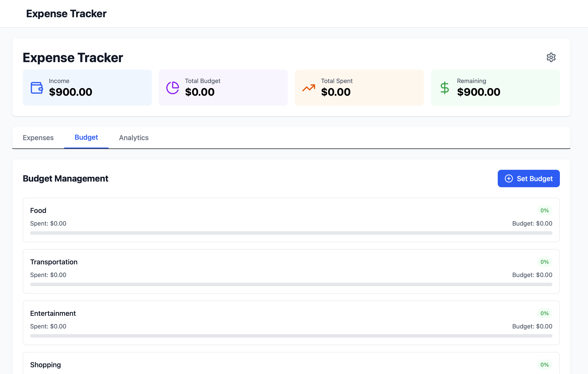
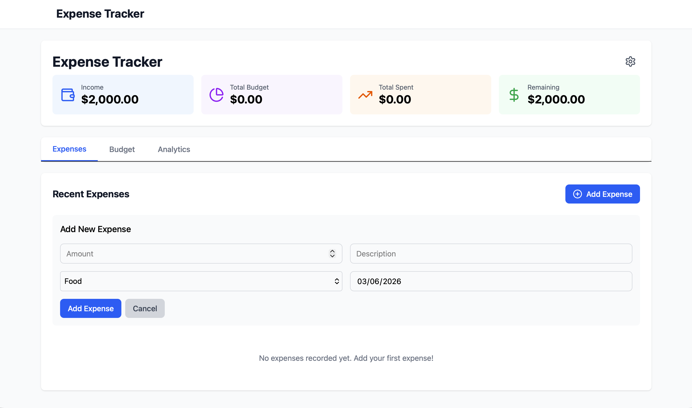
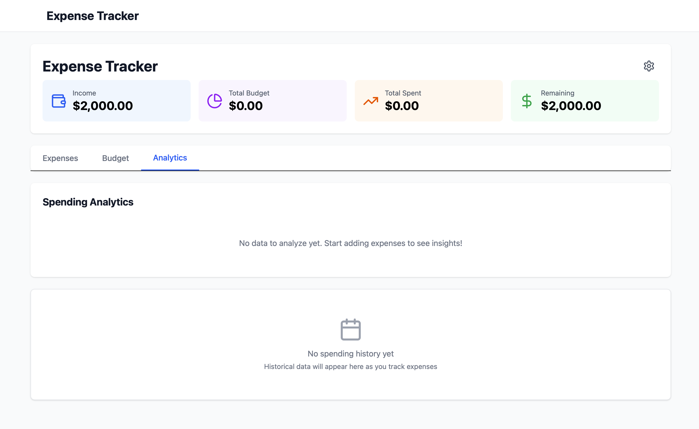
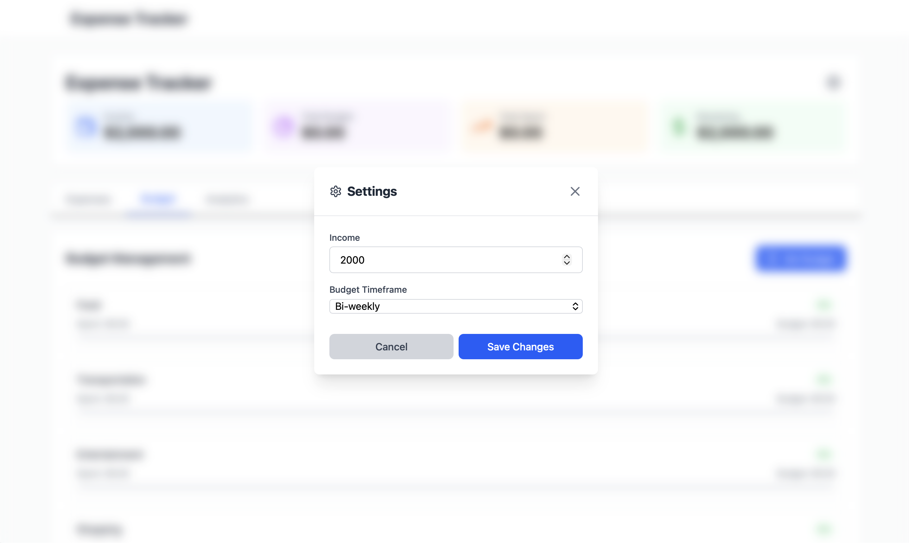

# Budget and Expense Tracker

A modern **React + TypeScript** application designed to help users manage their expenses, set budgets per category, and track spending over time - all while ensuring they never exceed their net income.

## Table of Contents

- [Features](#features)
- [Demo](#demo)
- [Built With](#built-with)
- [Getting Started](#getting-started)
  - [Prerequisites](#prerequisites)
  - [Installation](#installation)
  - [Available Scripts](#available-scripts)
- [Usage](#usage)
- [Project Structure](#project-structure)
- [Key Concepts](#key-concepts)
- [Contributing](#contributing)
- [License](#license)

## Features

- **Starting Income Setup** - Set your net income with flexible time intervals (weekly, bi-weekly, monthly)
- **Smart Budget Allocation** - Allocate budgets to categories without exceeding your total net income
- **Expense Management** - Add, edit, and delete expenses with ease
- **Real-time Tracking** - Live updates showing remaining income and category-specific balances
- **Visual Feedback** - Progress bars for each category to visualize spending
- **Budget Warnings** - Toast notifications when approaching or exceeding category budgets
- **Analytics Dashboard** - View spending distribution and insights across all categories
- **Responsive Design** - Fully responsive UI built with Tailwind CSS
- **Type Safety** - Full TypeScript support for robust development

## Demo

- **Set budget by category**
  

- **Add expenses**
  

- **Check spending Analytics**
  

- **Change the income ammount and income**
  

## Built With

- [Vite](https://vitejs.dev/) - Next generation frontend tooling
- [React 19](https://react.dev/) - UI library
- [TypeScript](https://www.typescriptlang.org/) - Type-safe JavaScript
- [Tailwind CSS](https://tailwindcss.com/) - Utility-first CSS framework
- [React Router](https://reactrouter.com/) - Client-side routing
- [React Hot Toast](https://react-hot-toast.com/) - Toast notifications
- [Lucide React](https://lucide.dev/) - Beautiful icons

## Getting Started

### Prerequisites

Before running this project, make sure you have the following installed:

- [Node.js](https://nodejs.org/) (v18 or higher recommended)
- npm (comes with Node.js) or [yarn](https://yarnpkg.com/)

### Installation

1. Clone the repository

   ```bash
   git clone https://github.com/Jefrow/Test_Expense_Tracker.git
   cd expense_tracker_ts
   ```

2. Install dependencies

   ```bash
   npm install
   ```

3. Start the development server

   ```bash
   npm run dev
   ```

4. Open your browser and navigate to `http://localhost:5173`

### Available Scripts

- `npm run dev` - Start development server with hot reload
- `npm run build` - Build for production (TypeScript compilation + Vite build)
- `npm run preview` - Preview production build locally
- `npm run lint` - Run ESLint for code quality checks

## Usage

### Step 1: Set Your Starting Income

1. On the landing page, enter your net income (starting budget)
2. Select your budget interval (weekly, bi-weekly, or monthly)
3. Submit to proceed to the budget allocation page

### Step 2: Allocate Category Budgets

1. Navigate to the **Budget** tab
2. Create spending categories (e.g., Groceries, Transportation, Entertainment)
3. Assign budget amounts to each category
4. The system ensures your total allocated budget doesn't exceed your starting income
5. View real-time remaining balance as you allocate funds

### Step 3: Track Expenses

1. Go to the **Expenses** tab
2. Add new expenses by selecting a category and entering the amount
3. Edit or delete expenses as needed
4. Watch your category balances update in real-time
5. Receive warnings if you're approaching or exceeding category limits

### Step 4: Analyze Spending

1. Visit the **Analytics** tab
2. View spending distribution across categories
3. Identify areas where you might be overspending
4. Make informed decisions about future budget allocations

## Project Structure

```
expense_tracker_ts/
├── pages/
│   └── BudgetPage.tsx            # Main budget and expense management
├── components/
│   ├── ExpenseTracker.tsx        # Root component
│   ├── analytics/
│   │   ├── Analytics.tsx
│   │   └── SpendingHistory.tsx
│   ├── budget/
│   │   ├── BudgetForm.tsx
│   │   ├── BudgetManager.tsx
│   │   └── BudgetProgressCard.tsx
│   ├── expenses/
│   │   ├── ExpenseForm.tsx
│   │   ├── ExpenseItem.tsx
│   │   └── ExpenseList.tsx
│   ├── layout/
│   │   ├── Header.tsx
│   │   └── Navigation.tsx
│   ├── settings/
│   │   └── SettingsModal.tsx
│   ├── setup/
│   │   └── SetupCard.tsx
│   └── shared/
│       ├── ActionButton.tsx
│       ├── FormInput.tsx
│       ├── FormSelect.tsx
│       ├── StatCard.tsx
│       └── TabButton.tsx
├── src/
│   ├── hooks/
│   │   └── useExpenseTracker.ts  # Custom hook for expense logic
│   ├── App.tsx                   # Main app component
│   └── main.tsx                  # App entry point
├── types/
│   ├── Budget.ts
│   ├── CategorySpending.ts
│   ├── Expense.ts
│   ├── Interval.ts
│   └── UserData.ts
├── package.json
└── README.md
```

## Key Concepts

### Budget Allocation Logic

- Your starting income is locked once set and serves as the maximum budget
- Category budgets must sum to less than or equal to your starting income
- Real-time validation prevents over-allocation
- Starting income cannot be changed after initial setup to maintain budget integrity

### Expense Tracking

- Each expense is tied to a specific category
- Category balances update automatically as expenses are added/removed
- Visual indicators (progress bars) show spending relative to budget
- Toast notifications provide immediate feedback for budget violations

## Contributing

Contributions are welcome! Here's how you can help:

1. Fork the project
2. Create your feature branch (`git checkout -b feature/AmazingFeature`)
3. Commit your changes (`git commit -m 'Add some AmazingFeature'`)
4. Push to the branch (`git push origin feature/AmazingFeature`)
5. Open a Pull Request

## License

This project is open source and available for educational and personal use.
